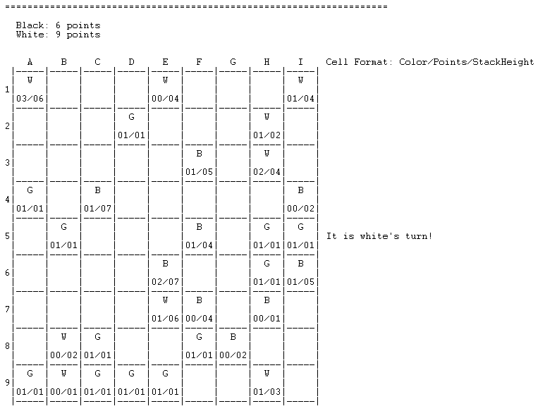

# PLOG 2020/2021  

## Group T3_Greener2


| Name             | Number    | E-Mail             |
| ---------------- | --------- | ------------------ |
| Daniel Garcia Lima Sarmento da Silva    | 201806524 |up201806524@fe.up.pt|
| Mariana Almeida Truta    | 201806543 |up201806543@fe.up.pt|

----
## Instalation and Execution

### SICStus Prolog Instalation 

* [Linux](https://sicstus.sics.se/download4.html#unix)
* [Windows](https://sicstus.sics.se/download4.html#win32)

### Execution

To play the game:

* run SICStus Prolog;
* go to `File > Consult` and select the file [greener.pl](LINK
* *Alternatively*: run `consult('path\to\greener.pl')`.
* run `play.` in the console to start the game.

----
## [Greener](https://www.boardgamegeek.com/boardgame/226081/greener)

### Description

**Greener** is one of the three games of the **GreenGreenerGreenest** set. It is a capturing game for 2 players, where both aim to capture the same color, green.
Depending on the set, there should be:

* Basic: a 6×6 board, 15 black pyramids, 20 green pyramids, 15 white pyramids.
* Advanced: a 6×9 – 9×9 board (using one or both pads), 30 black pyramids, 45 green pyramids, 30 white pyramids.

### Setup  

First of all, it is necessary to calculate the **number of pieces** of each color: the number of black and white pyramids must be between a quarter and a third of the board cells and there must be _at least_ as many green pyramids as black/white pieces.  For example, it is recommended to use 9 black, 9 white and 18 green pieces on a 6×6 board.

Secondly, each player will have an allocated color (**black** or **white**) and will alternately place **one piece at a time** on the board. The remaining cells will be filled with **green** pyramids.

### How to play

Usually **black** starts. Players **alternate** turns during the game, moving zero or one piece at a time **orthogonally** (vertically or horizontally). They **must** capture one pyramid or stack of **any** color if possible; otherwise, they have to **pass** the turn. 

The **game ends** when all players pass in succession. The player with the **most green pyramids** captured (being part of stacks they control) wins the game. In case of a **tie**, the player with the **highest stack** wins. If the tie persists, **play again**.

[Rules Book](https://nestorgames.com/rulebooks/GREENGREENERGREENEST_EN.pdf)

---
## Game Logic

### **Game State Representation**

**Important information**

At any point during the game, it is crucial that both players know these things:

* Whose **turn** it is;
* For each board cell:
    - The **color** of the piece at the top of the stack;
    - The amount of **points** (green pieces in the stack);
    - The stack **height** (number of pieces in the stack).

We also provided the **points** both players currently have.

**How we did it**

* GameState: a list of rows;
* Row: a list of cells;
* Cell: a list of 3 values: 
    - Color of the top piece:
        * 0 - **Empty** cell
        * 1 - **Green** piece
        * 2 - **Black** piece
        * 3 - **White** piece
    - amount of green pieces in the stack (points)
    - stack height.
 
This is how that list looks like, internally (for a 6x6 game):

```prolog
[
[[0, 0, 0], [0, 0, 0], [0, 0, 0], [0, 0, 0], [0, 0, 0], [2, 1, 2]],
[[0, 0, 0], [0, 0, 0], [0, 0, 0], [2, 4, 7], [0, 0, 0], [0, 0, 0]],
[[0, 0, 0], [0, 0, 0], [0, 0, 0], [0, 0, 0], [0, 0, 0], [1, 1, 1]],
[[0, 0, 0], [0, 0, 0], [3, 7, 17], [0, 0, 0], [0, 0, 0], [0, 0, 0]],
[[0, 0, 0], [1, 1, 1], [0, 0, 0], [0, 0, 0], [1, 1, 1], [3, 0, 1]],
[[2, 1, 2], [0, 0, 0], [3, 1, 2], [0, 0, 0], [1, 1, 1], [3, 0, 1]]
]
```

We also mantain a **Player** list, which is a list of 2 Player sublists. The first player corresponds to whose turn it is. These sublists have 3 values:

* the player's color:
    - 0 - Black
    - 1 - White
* the player's current points, updated every move;
* the player's level:
    - 0 - **Human**
    - 1 - Computer **Random**
    - 2 - Computer **Smart**

A **Player** list, at the beginning of a game of Human vs Computer Random, would look like this:

```prolog
[[0, 0, 0], [1, 0, 1]]
```


### Game State Visualization

The `play` predicate does these things, in order:

1. Gets information about the players;
2. Gets information about the board;
3. Displays the initial board and player information;
4. starts the game loop.

In the following sections, the first **three** steps will be detailed, as these regard the **Game State Visualization**.

Note: All these inputs are read one character at a time, and if any of them fail, this message will be printed and the user will be prompted again. For example:


**Player Information**

The information about the players is gathered first. This is achieved in the `getPlayerOptions(Player)` predicate, which:

* displays the player selection menu, with the `displayMenu` predicate;

    

* reads the option from the console, with `readMenuOption(Option)`;
    1. Read the character
    2. Check for invalid input
    3. Get the number atom correspondent to the character read (with `option(OpChar, Option)`)

* gets the **Player** list, according to `Option`, with `getPlayerFromOption(Option, Player)`.
    - the first player is always black;
    - both players begin the game with 0 points;
    - human players have a level value of 0;
    - If the option selected involves a computer player, there is a menu to select its level:
    


**Board Information**

After all the player information is gathered, we move on to the board information. This is achieved with the `getInitialGameState(GameState)` predicate, which:

* displays the board size selection menu, with the `displayBoardSizes` predicate;
    

* reads the option from the console;
    1. Read the character
    2. Check for invalid input
    3. Get the number atom correspondent to the character read (with `option(OpChar, Option)`)

* generates the initial board, according to `Option`, with `initBoard(GameState, Option)`.
    * `initBoard` calls `generateBoard` with the appropriate parameters:
        - with a 6x6 board, there are 9 Black pieces, 9 White pieces, and 18 Green pieces
        - with a 9x6 board, there are 18 pieces of each color
        - with a 9x9 board, there are 27 pieces of each color
    * `generateBoard` calls `generateRow` until all the rows are filled;
    * `generateRow` generates a random color for the cell piece, and calls `generateCell`. Until all the columns are filled, it keeps calling itself;
    * `generateCell` returns a list with the appropriate values (as explained in the Game State Representation section above) and deprecates the number of possible respective color's pieces.
        - if the number of the possible respective color's pieces is 0, it generates another random color and calls itself with the new color

**Displaying the board**

Now, the initial board is generated and displayed:

* Initial Boards:

    * 6x6 board

        

    * 9x6 board

        

    * 9x9 board

        

* Intermediate Boards:

    * 6x6 board

        

    * 9x6 board

        

    * 9x9 board

        


* Final Boards:

    * 6x6 board

        

    * 9x6 board

        

    * 9x9 board

        

The `display_game(GameState, Player)` predicate:

* prints a separator line;

* prints each players current points, with `printPlayersPoints(Player)`;

* prints the board, along with the information about whose turn it is, with `printBoard(GameState, Color)`, which:
    1. gets the number of columns and rows, with `sizeBoard`;
    2. prints the column coordinates and cell format information, with `printHeader`;
    3. prints the board, row by row, with `printTab`.
        - `printSeparator` prints either a dashed or a spaced separator;
        - each row has 3 lines:
            1. color for each cell
            2. row number and decluttering space
            3. points and stack height for each cell
        - `printInfo` prints whose turn it is, if the row being printed is row 4

### List of Valid Moves

Our `valid_moves(GameState, Player, ListOfMoves)` predicate uses `sizeBoard` to get the number of columns and rows of the board, and then calls the `availableMoves(GameState, Color, Index, MaxCol, MaxRow, List, MovesList)` predicate, with the index starting at 0, which:

1. gets the colum and row of the Cell `Index`, with `getColRowbyIndex`;

2. checks the moves of that Cell, with `availableCell(GameState, Color, CurrentCol, CurrentRow, MaxCol, MaxRow, Moves)`
    - if the Cell does not belong to the current player, the moves returned is an empty list
    - if the Cell does belong to the current player, it checks the possible move in each ortogonal diretion with the `available[DIRECTION]Move` predicates, which returns the closest non-empty Cell in that direction, in a list with the format `[[Column, Row]]`
    - for each valid Cell the current piece can be moved to, a move in the format `[[CurrentCellColumn, CurrentCellRow], [EndCellColumn, EndCellRow]]` is appended to the Moves list, with the `addMove` predicate

3. repeats for all Cells

### Move Execution

Our `game_loop` predicate:

1. checks if any of the players have valid moves, with `isFinished`

    - if both players are out of valid moves, ends the game with `finishGame`

2. calls the `nextMove` predicate, which:

    - processes this turn's move, with `processTurn`

        - checks if the current player has any available moves, with `hasAvailableMoves`

        - obtains the move to be made, with `getMove`

            - if the current player is a human, `readMove` is called:

                1. reads the coordinates of the piece that the player wants to move and verifies if it belongs to the player;

                2. displays the possible moves

                3. reads the option chosen

                
            
            - if the current player is a computer, `choose_move` is called instead

                

        - obtains the new GameState and Player lists, with `move`

        - if the player does not have any available moves, the turn is skipped:

            
    
    - changes the current player, with `changePlayer`

    - displays the new state of the game, with `display_game`

3. calls itself until the game is finished

In our `move(GameState, Move, NewGameState)` predicate, the *GameState* and *NewGameState* are composed of a list of length 2, with the board (GameState, as we refered to it earlier) as its first element, and the Player list as its second element. The Move comes in the format `[[StartCell, StartCol, StartRow], [EndCell, EndCol, EndRow]]` The predicate:

1. updates the player's points, with `updatePoints`
    - if the color of both Cells is the same, the points remain the same for both players;
    - if the color of the `EndCell` is Green (1), the current player gets one more point, and the other player's points remain the same;
    - if the color of the `EndCell` is the other player's color, the current player's points are incremented by the points value in that Cell, and the other player's points are decremented by the same amount

2. updates the board, with `updateBoardGame`

    1. calculates the new Color, Points and Stack Height values for the `EndCell` with `updateCell`
    2. updates the board, first with an empty Cell in the `StartCell` spot, then with the new Cell in the `EndCell` spot, with the `updateBoard` predicate
        - iterates through the rows until it finds the right one
        - iterates through the columns until it finds the right one
        - substitutes the Cell list in those coordinates with the new Cell values


### Game End

Our `game_over(GameState, Winner)` predicate:

1. gets the points and highest stack height for each player, with `countPointsStack`
    - gets a list of pieces for each player, by iterating through every Cell
    - gets the total points and the highest Stack height of each player, with `processPlayerPieces`

2. displays each players, with `displayPointsStack`

    

3. compares the values and gets the winner, with `getWinner`
    - 0 means Black won
    - 1 means White won
    - 2 means it was a tie

### Board Evaluation

Our `value(GameState, Player, Value)` predicate returns in `Value` the best move for the current player, in the format `[[StartColumn, StartRow], [EndColumn, EndRow]]`. It obtains this move by:

1. getting a list of valid moves, with `valid_moves`;

2. getting the best move, with `bestMove(GameState, Player, ListOfValidMoves, CurrentBestMove, FinalMove, CurrentBestValue, FinalValue)`

    - the value of each move is a list of two elements:
        1. the point difference between before making the move and after making the move;
        2. a number that represents the piece that was taken:
            - -1 - a piece of the same color was taken
            - 0 - a green piece was taken
            - 1 - a piece of the opponent's color was taken

    - this predicate is first called with an empty CurrentBestMove `[]` and a negative CurrentBestValue `[-1, -2]`

    - it iterates through all valid moves, and:
        1. calculates the move's Value

        2. compares it with the CurrentBestValue and decides if it changes
            - if the point difference is larger, it changes the CurrentBestMove
            - if the point difference is smaller, it remains the same
            - if the point difference is equal, the decision is made with the second number in the Value list, by the same criteria
            - if both these numbers are equal, it randomly decides if it changes the CurrentBestMove

        3. repeat until all moves have been processed

### Computer's Move

Our `choose_move(GameState, Player, Level, Move)` chooses the move the computer is making, based on its level:

1. Random - chooses a random move from the valid moves list

2. Smart - chooses the move returned by the `value` predicate

---
## Conclusions

In conclusion, the development of this game in PROLOG helped us learn and comprehend the inner workings of logic programming, as well as the syntax of the language.

We did not encounter any issues, however we could improve this code by using the `repeat` and `findall`, `setof` or `bagof` predicates, as well as increasing the variables that the smart computer takes into account when deciding where to move.

---
## Bibliography

* [SWI Prolog](https://www.swi-prolog.org/)
* Moodle slides
* Google Jamboards from TP classes
